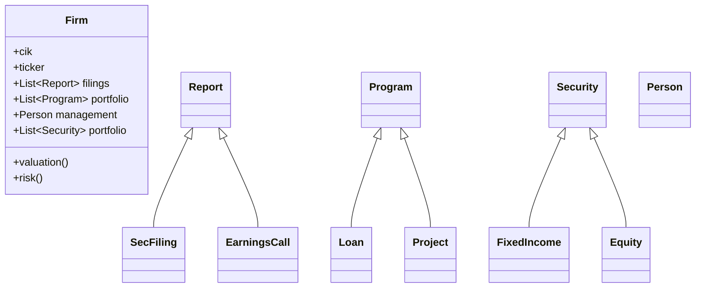
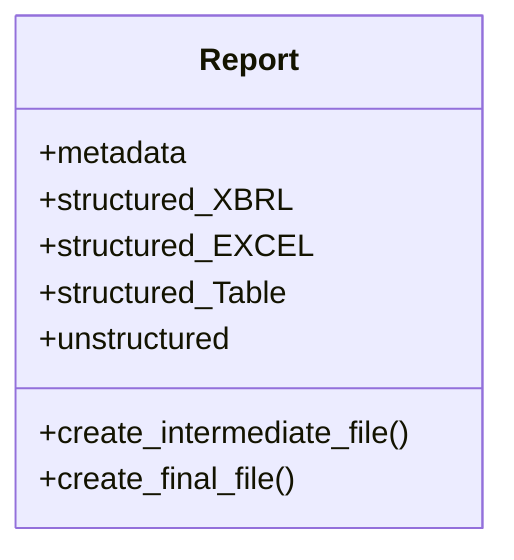

# SEC Workflows

This application combines multiple projects to obtain financial and economic data, then transforms and organizes it for easy use in a variety of workflows.


## Data Sources

* SEC EDGAR
  - firm information: name, cik, ticker, etc.
  - daily filings
  - firm filing details: data and exhibits
  - batch archive
* Earnings Call transcripts
  - most recent
  - batch archive
* Daily stock / bond yield
  - current
  - batch archive
* Economic indicators
  - current calendar
  - economic
  - firm


## Class structure

General overcview



Current work




## TODO

* Firm
  - ~~get firm_info: cik, ticker, etc~~
  - check available (downloaded) reports
  - add
      <api> https://data.sec.gov/submissions/CIK0000051143.json
      <browser> https://www.sec.gov/edgar/browse/?CIK=1084869
* Report 
  (sec-edgar-downloader): get_filing_urls_to_download()
  ```
  >>> from sec_edgar_downloader._utils import get_filing_urls_to_download
  >>> get_filing_urls_to_download("10-K", "AAPL", 20, "2010-12-31", "2019-12-31", False)
  ```
  - ~~get number of filings in criteria~~
  - ~~get filing urls in criteria~~
  - ~~make get_filing_urls_to_download() public method~~
  - ~~scrape File Detail page for url~~
  - new layout:
    + Downloader > utils.get_filing_urls_to_download() then Filing
    + first, try standard url
    + then try scraping
  - steps:
    + use FilingMetadata(.constants.py) for _url_doc_types (UrlComponents.py)
    + mod utils.get_filing_urls_to_download() to get additional doc urls
    + study all the urls and see how they change over time (sampling)
    + document these sampled urls
    + whatever utils.get_filing_urls_to_download() will get done by Filing scraper
    + continue Filing improvements
  - get url of excel file (only useful for 10k,10q)
  (py-xbrl)
  - download, organize filings in criteria
  - download, organize exhibits / html, xbrl, zip, etc.
  (this repo)
  - add these modules to this repo: Report
  - download, organize excel file
* action: prepare sample of reports to improve parsing
* Report_Table
  - associate ixbrl (html) table with py-xbrl data


## References

* [sec-edgar-downloader](https://github.com/jadchaar/sec-edgar-downloader)
* ixbrl, xbrl, html
  - [ixbrlparse]()
  - [python-xbrl]()
  - [py-xbrl]()
* [mermaid diagrams](https://mermaid-js.github.io)