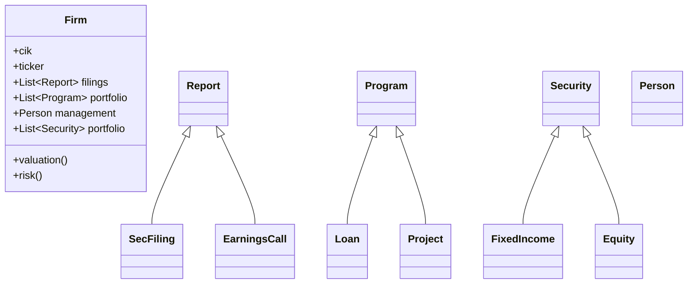
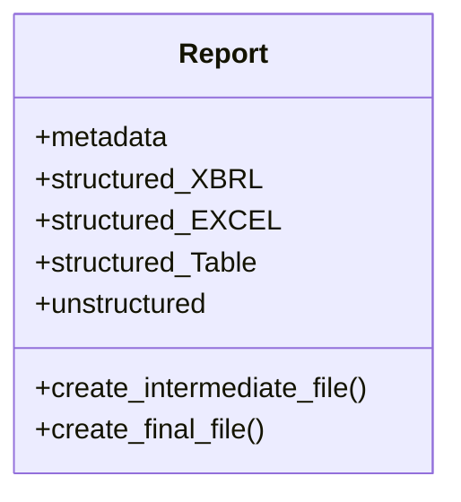

# Background Documentation

This application combines multiple projects to obtain financial and economic data, then transforms and organizes it for easy use in a variety of workflows.

## Data Sources

* SEC EDGAR
  - firm information: name, cik, ticker, etc.
  - daily filings
  - firm filing details: data and exhibits
  - batch archive
* Earnings Call transcripts
  - most recent
  - batch archive
* Daily stock / bond yield
  - current
  - batch archive
* Economic indicators
  - current calendar
  - economic
  - firm

## Class structure

General overcview

Current work

## References

* [sec-edgar-downloader](https://github.com/jadchaar/sec-edgar-downloader)
* ixbrl, xbrl, html
  - [ixbrlparse]()
  - [python-xbrl]()
  - [py-xbrl]()
* [mermaid diagrams](https://mermaid-js.github.io)